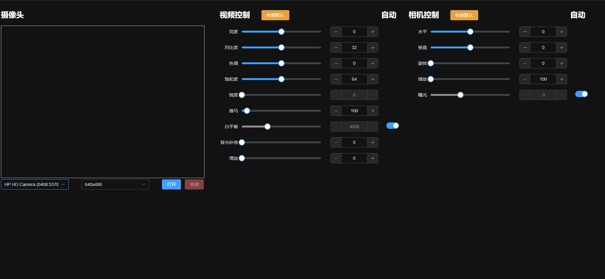

# camera-settings [](https://npmjs.com/package/camera-settings)

English | [中文](./README.zh-CN.md)

Retrieve and modify the configuration of USB cameras, supporting both Windows and Linux environments. Typically used for Electron applications.

- On Windows, it uses [DirectShow](https://docs.microsoft.com/en-us/windows/win32/directshow/directshow).
- On Linux, it uses [v4l2](https://www.kernel.org/doc/html/v4.9/media/uapi/v4l/v4l2.html).



## Installation

```bash
npm install camera-settings
```

## Usage

```ts
import { CameraSettings } from "camera-settings";

(async () => {
  const cs = new CameraSettings(0);
  await cs.open();

  // Get camera settings
  const settings = await cs.getSettings();

  // Modify camera settings, such as white balance
  await cs.setSettings([{ prop: "WhiteBalance", val: 2900, isAuto: true }]);

  // Get all available resolutions
  const resolutions = await cs.getResolutions();

  await cs.close();
})();
```

## API

### `CameraSettings`

#### `constructor(cameraId: number | string)`

- `cameraId` Camera index, starting from 0, or the camera name, e.g., `HD USB Camera`

#### `open(): Promise<void>`

Performs initialization tasks, such as finding the device.

#### `close(): Promise<void>`

Clears cache and releases resources.

#### `getSettings(): Promise<CameraSetting[]>`

Retrieve camera settings.

```ts
interface CameraSettingInfo extends CameraSettingSetInfo {
  prop: TagCameraControlProperty | TagVideoProcAmpProperty;
  val: number;
  isAuto?: boolean;
  min: number;
  max: number;
  step: number;
  /** rangeFlags & 1 Auto; rangeFlags & 2 Auto Manual */
  rangeFlags: number;
  /** Default configuration */
  def: number;
  ctrlType: "video" | "camera";
}
```

#### `setSettings(settings: CameraSetting[]): Promise<void>`

Modify camera settings.

```ts
interface CameraSetting {
  prop: TagCameraControlProperty | TagVideoProcAmpProperty;
  val: number;
  isAuto?: boolean;
}
```

#### `getResolutions(): Promise<Resolution[]>`

Retrieve all available resolutions.

```ts
interface Resolution {
  width: number;
  height: number;
  /** mjpg, yuy2, yuyv... */
  type: string;
}
```